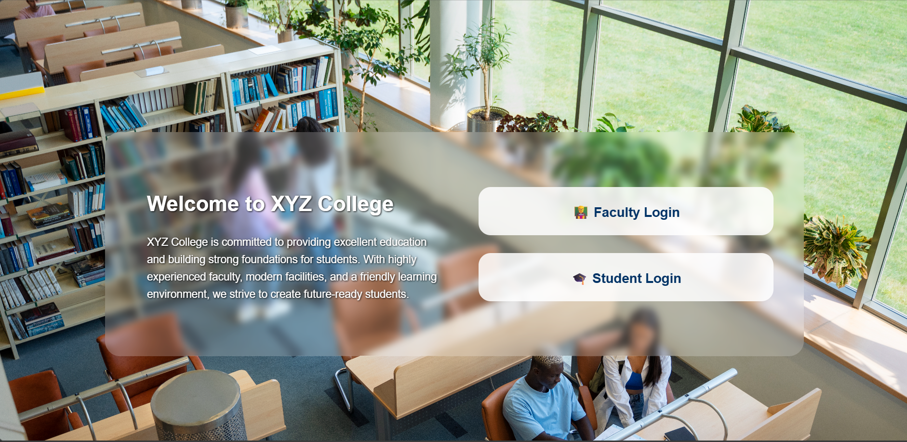
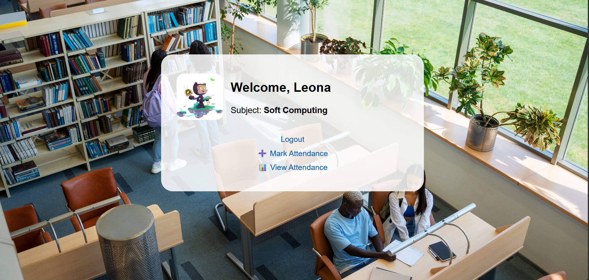

# Student Attendance Tracker

A **Django-based web application, Student Attendance Tracker is designed to simplify attendance management for schools and colleges. Built with Python, Django, HTML, CSS, and JavaScript, it allows teachers to securely log in, mark attendance, and generate reports. The app saves time, reduces manual errors, and improves accountability, making attendance tracking efficient and reliable for both teachers and students.

---

## 🌟 Features

- **Teacher Login & Authentication**
- **Add/Edit Student Attendance**
- **View Attendance Reports**
- **User-friendly Dashboard**
- **Secure with Django Authentication**
- **Responsive Design for Desktop & Mobile**

---

## 🛠️ Technologies Used

- **Backend:** Django (Python)
- **Database:** SQLite (default, can be changed)
- **Frontend:** HTML, CSS, JavaScript
- **Version Control:** Git & GitHub

---

## 📸 Screenshots

### Home Page

### Faculty login Page

### Student Login Page

### Faculty Dashboard Page

